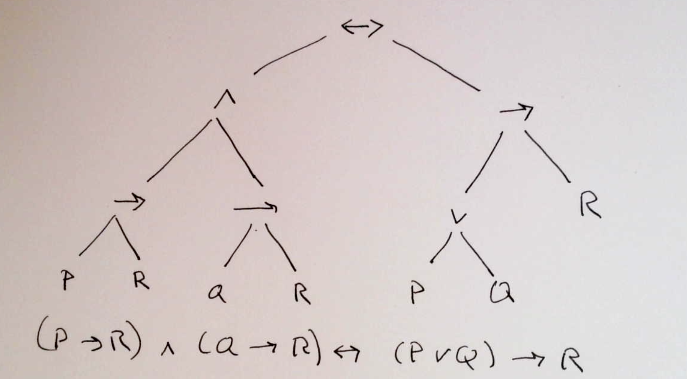
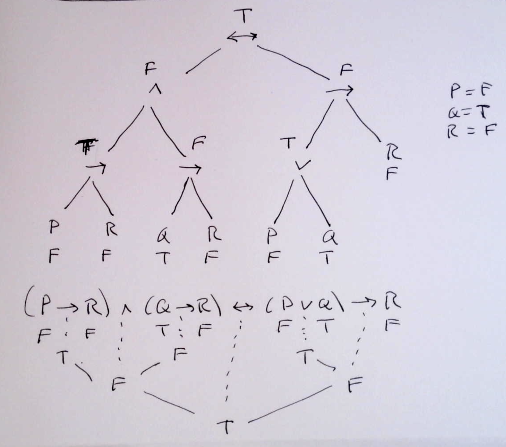

# Propositional Calculus Parse Trees

For large sentences in the propositional calculus, also known as boolean formulas, it can sometimes be easier to
represent the formula in a graphical form as a "tree".  This is particularly useful if you want to evaluate a formula
on a particular assignment of truth values to the variables of the formula.

## Example

Below is an example of a parse tree for the formula
 $(P \rightarrow R) \wedge(Q\rightarrow R)) \leftrightarrow (P\vee Q \rightarrow R)$

Observe that you don't need paretheses in a parse tree as it is completely clear which subexpressions correspond to which operators.

## Evaluating a formula with a parse tree

Below is an example showing how to use a parse tree to find the value of a boolean expression
for a particular assignment of truth values to the variables.

You can either draw the "tree" above the formula, or below the formula.
In the image we put in the truth values of the subexpressions with a dotted line to the operator.

Parse Trees for Expressions are an important concept in Computer Science, and we'll return to them
we look at Graph Theory toward the end of this class.
