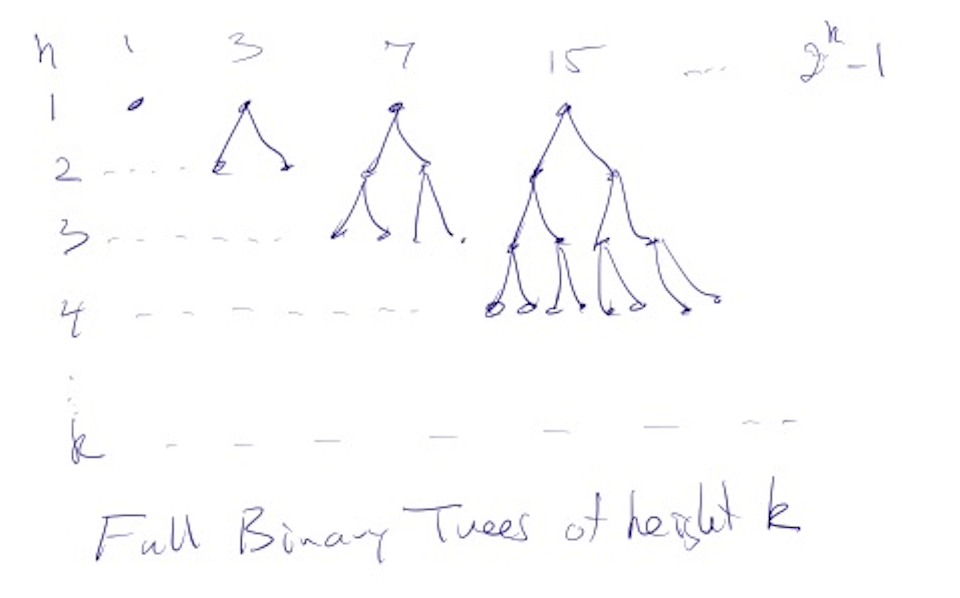
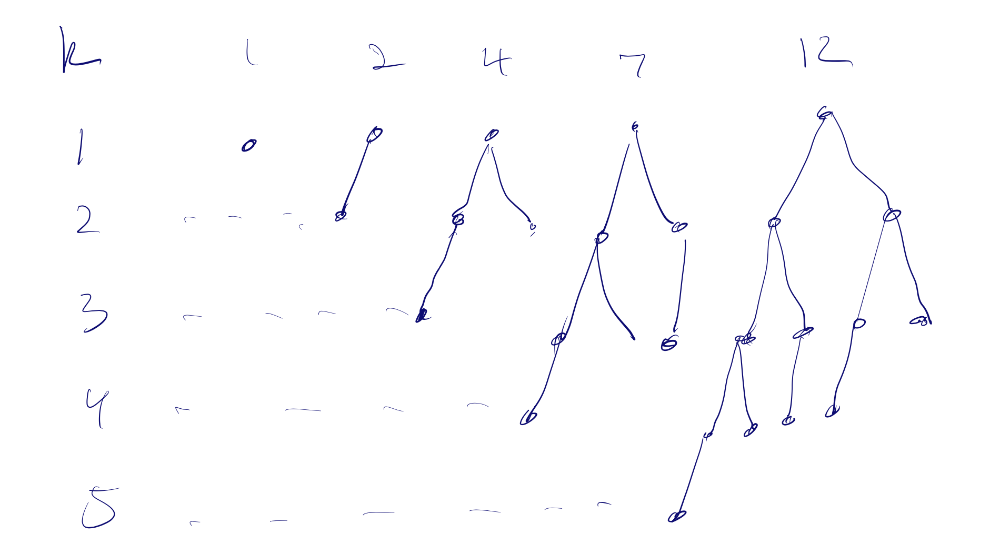

# Applications of Sequences to Priority Queues and AVL trees

The techniques we've used for solving recursive equations have many applications in Computer Science.
In this note, we will show how a variation of the fibonacci sequence has applications in finding the
performance of certain algorithms for quickly storing and looking up data.

In this note we will sketch out the proof that the basic operations of an AVL tree (defined below)
can be done in time about $\log_2(n)$.  These operations are to insert or remove an element from the tree
and to find whether a given element is in the tree. The main point we want to illustrate here is the
way in which recursion equations like the ones we've been studying arise when analyzing the execution time
of interesting (and important) programs.

## Priority Queues and Full Binary Trees
A full binary tree of height k is a tree in which every node has exactly two children and the every leaf
has exactly k+1 ancestors. The image below shows the binary trees of heights 1,2,3,...

If B(k) is the number of nodes in a binary tree of height k, then $B$ satisfies the following recursion equation:
* $B(1)=1$
* $B(k) = 2*B(k-1) + 1$
and we can prove by induction that this means $B(k) = 2^k-1$

Full Binary trees are used to implement what is called a Priority Queue. The idea is that one inserts elements 
into the Queue or removes "the lowest" element.  The Queue is a full binary tree except that the last row
is only full on the left. The time to insert a new element or remove the smallest is proportional to the
height of the tree and since a full binary tree of height h has about $n=2^h$ nodes, we conclude that the height
h is proportional to $\log_n$.
* $n=2^h$  so $h = \log_2(n)$

and this makes for a very efficient algorithm it can insert or remove up to a billion nodes with only about 30
steps for each of these operations!

## Fibonacci trees.
The fibonacci trees can be defined recursively as follows:
* $F_1$ is a single node
* $F_2$ is a tree where the root has one child on the left and none on the right
* $F_k$ for $k>2$ is a tree whose left child is $F_{k-1}$ and whose right child is $F_{k-2}$

Below we see the first few Fibonacci trees

The number of $F(k)$ in the fibonacci tree of height k satisifies the following recursion equation:
* $F(1)=1$
* $F(2)=2$
* $F(k) = 1+ F(k-1)+F(k-2)$ for all $k\ge 3$

where the $1$ corresponds to the root of the tree and the other terms to the two children

and if we let $f = (1,1,2,3,5,8,13,21,34,...)$ be the usual fibonacci sequence then we can prove the following theorem by induction

---

**Theorem.** $F(k) = f_{k+2}$ for all $k\ge 0$.

**Proof:** We leave the proof to you as an exercise in our homework! **QED**

---

We have already found a formula for the nth fibonacci number,  
* $f_n$ is $(\beta_1^n - \beta_2^n)/\sqrt{5}$
* $\beta_1 = (1 + \sqrt{5})/2 = 1.6180...$
* $\beta_2 = (1 - \sqrt{5})/2 0 -0.618...$

so $f(n)$ is about $1.618^n/\sqrt{5}$ since $\beta_2^n$ is always between -1 and 1 and gets close to zero as $n$ gets large.
So we have the following:

---

**Corollary.** $F(k)$ is the closest integer to $1.17..*1.618..^k$.

**Proof:** 
We know that $F(k) = f_{k+2}$  and $f_{k+2} = \beta^{n+2}/\sqrt{5} = \beta^n * c$ where $c = \beta^2/\sqrt{5} = 1.17...$
**QED**

---

**Corollary.** The height of the Fibonacci tree with $n$ nodes is at most $1.44 \log_2(n)$.

**Proof:**
By the previous Corollary we know that the number of nodes $n$ in the Fibonacci tree of height $k$ satisfies
* $n = 1.17 * 1.618^k$

so $k = \log_{1.618}(n/1.17) = \log_2(n/1.17)/\log_2(1.618) \lt 1.44 \log_2(n)$

**QED**

---

---

## AVL Trees
One of the most important data structures we learn about in a Data Structures and Algorithms class is the AVL tree. This is a tree whose nodes
contain important information and there are algorithms that can search for a value in an AVL tree, or add a new value or remove a value, and the time
of these operations is proportional to the height of the tree.  The key property of the AVL tree is the following:
* the heights of the two children of any node in the tree are either the same or differ by 1

Because of the AVL property, the number $N$ of nodes in an AVL tree is always between $B(k)$ and $F(k)$ as the most dense AVL tree of height k is a full binary tree
and the least dense is the Fibonacci tree. 
* $2^k-1 \le N \le \beta^{n+2}/\sqrt{5} = \beta^n * c$ where $c = (\beta^2/\sqrt{5}) = 1.17...$ and $\beta = 1.618...$ is the golden ratio.

This gives us a bound on the height $H$ of an AVL tree with $n$ nodes
* $\log_2(n) \le H \le \log_\beta(n/c) \lt $\log_\beta(n)$

and $\log_\beta(n) = \log_2(n)/\log_2(\beta) = 1.44... \log_2(n)$

This gives us a bound on the efficiency of the AVL operations.

---

**Theorem** The time $T(n)$ it takes to search for an element in an AVL tree of size n, or to insert or remove an element satisfies
* $\log_2(n) \lt a*T(n) \lt \log_2(n)$ for some constant a depending on the speed of the computer.

**Proof.** Here we are assuming that these operations take time $h/a$ proportional to the height $h$ of the tree for some number $a\gt 0$
and we know from our recursion equations that the height is between $\log_2(n)$ and $1.45 \log_2(n)$.  The constants $a$ and $b$ give the proportions... **QED**

---

