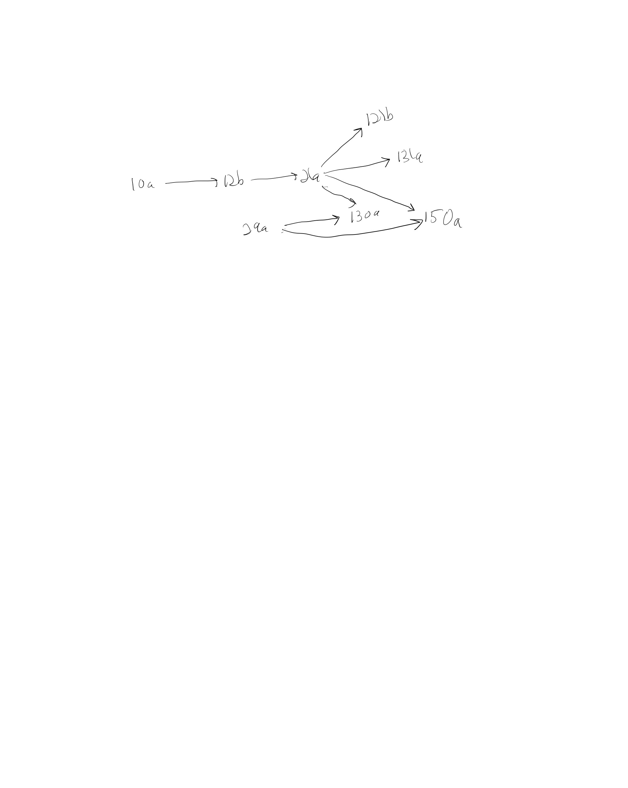

# F26 Graph Theory: Basic Properties

* [Skill Description](#skill-description)
* [Sample Problems](#Sample-Problems)
* [Skill Tutorial](#Tutorial)
* [Answers to Sample Problems](#Answers)
* [Further Reading](#Reading)

---

# Skill Definition
Ability to convert between different representations of graphs and to understand basic graph vocabulary.

---

# Sample-Problems

We will not be directly assessing your mastery of Binary Relations in this class,
but here are some problems about binary relations you can try if you're interested.

## Problem 1

---

# Tutorial

## Directed Graphs

A **directed graph (or digraph)** $G$ is a pair $(V,E)$ where $V$ is a set of vertices or nodes, and $E$ is a subset of $V \times V$ called the edges of $G$.
We can draw a 2d visual representation of a graph by plotting each of the points $v$ of $V$ as distinct point $p(v)$ on the x-y plane and then
for each edge $(a,b)$ in $E$ draw a line between the points $p(a)$ and $p(b)$, usually with an arrow at the end point to $b$. 

We say that the the edge $d=(a,b)$ goes from $a$ to $b$,
* $a$ is the tail of $e$
* $b$ is the head of $b$

Here is an example of a digraph G=(V,E) of some Computer Science course numbers where the edges represent prerequisite relationships.

| Vertices | Edges | graph |
| --- | --- | --- |
| V = \{10a, 12b, 21a, 29a, 121b, 130a, 131a, 150a\}| E = \{ (10a,12b), (12b,21a), (21a,121b) (29a,130a), (21a, 131a), (21a, 150a), (29a,150a) \}| |

## Path and Cycles
A **path** in a digraph is a connected sequence of edges starting at a vertex $v$ and ending at a vertex $w$.
If $v=w$ then we say that the path is a **cycle**, that is, it is a path that ends at the same vertex it started at.

---
---

# Answers

## Problem 1

---
