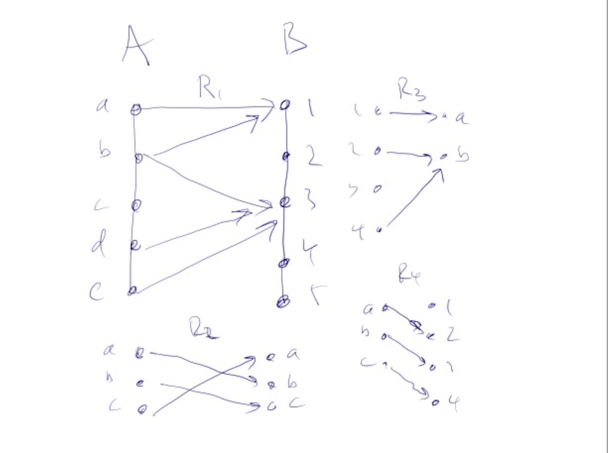

# F26 Graph Theory: Binary Relations

* [Skill Description](#skill-description)
* [Sample Problems](#Sample-Problems)
* [Skill Tutorial](#Tutorial)
* [Answers to Sample Problems](#Answers)
* [Further Reading](#Reading)

---

# Skill Definition
Ability to reason about binary relations, including their properties 
as multi-valued functions, and the special cases of partial orders and
equivalence relations.

---

# Sample-Problems

We will not be directly assessing your mastery of Binary Relations in this class,
but here are some problems about binary relations you can try if you're interested.

## Problem 1
Let $f$ be a multi-valued partial functions from $A$ to $B$.
Let $f^{-1]$ be defined by $f^{-1}(b) = \{a\in A : f(a)=b\}$
where for any particular $b$ there may be many such $a$ as f is a multi-valued function.

Show that
* $f$ is single-valued if and only if $f^{-1}$ is injective
* $f$ is total if an only if $f^{-1}$ is surjective
* $f$ is surjective if and only if $f^{-1}$ is total
* $f$ is injective if and only if $f^{-1}$ is single-valued

## Problem 2.
Let $a \preceq b$ be a partial order on the integers defined by 
$$ a \preceq b$ iff there are odd numbers c and d such that $a * c \le b * d$.
Show that $a$ and $b$ are in the same equivalence class iff and only if they have the
same power of 2 in their prime factorizations and $a\preqeq b$ iff and only if the
power of 2 in the prime factorization of $a$ is less than or equal to the power of 2 in the prime factorization of $b$.

---

# Tutorial

## Binary Relations

A **binary relation** is a subset $E$ of $A\times B$ for two sets $A$ and $B$ or equivalently a boolean function $R:A\\times B \rightarrow \mathbb{B}$.
When viewed as a boolean function we write
* $aRb \leftrightarrow (a,b)\in E \leftrightarrow R(a,b)=T$

Examples: 
* Let $\mathbb N$ be the natural numbers and let $R$ be the relation defined by $R(a,b) \leftrightarrow a\le b$
* Let $H$ be the set of all five card poker hands and let $R(h1,h2)$ be true if $h2$ is worth more than $h1$
* Let $f:A\rightarrow B$ be a partial function and define $R(a,b) \equiv  f(a)=b$, so every graph can be viewed as a relation

## Multi-valued Partial Functions
Another way to think about a relation is as
a *multi-valued partial function*, which is a function $f:A \rightarrow 2^B$ where $f(a)$ is the set of values that $f$ takes on $a$
which could be empty, could be a single value $b$ or could be set of values $\\{b)1,\ldots,b_n\\}$

For example, we can define $f_1:\mathbb{R} \rightarrow 2^\mathbb{R}$ by $f_1(x)$ is the set of real numbers such that $y^2=x$.
So $f_1(4)= \\{2,-2\\}$ and $f_1(0) = \\{0\\}$ and $f_1(-1) - \\{\\}$, we usually write this as $f_1(x) = \pm \sqrt{x}$.

Let $R$ be the relation defined by $R(x,y) \equiv x=y^2$ then $R$ can be viewed as the multivalued partial function $f_1(x) = \pm \sqrt{x}$

Any binary relation $R$ can be viewed as a multi-valued partial function $f$ and vice versa via
* $aRb \equiv b\in f_R(a)$ and
* $f_R(a) = \\{b: aRb\\}$
We sometime just write $R(a)$ instead of $f_R(a)$.

We can define the image and the inverse image of a set under $R$ in the same way as for functions:
* $R(S) = \\{b: \exists a \ aRb\\}$
* $R^{-1}(T) = \\{a: \exists b\  aRb\\}$

We can also compose multivalued partial functions
* $R_1(R_2(S)) = \\{c\in C | \exists a\in A \exists b\in B aR_1b \wedge bR_2c\\\}$

In other words, it is the set of all elements which can be reached by the following the arrows
from a node in $S$.

## In and out degree
The figure below shows four binary relations

* R1 is not a function, it is however a multi-valued partial function
* R2 is a bijection
* R3 is a surjective partial function
* R4 is an injective function

We can extend the notion of injectivity and surjectivity to Relations by looking at the number of edges leaving each node in A (the out degree)
and the number of edges going into a node in B,  the in degree.
* R is a function if the outdegree $\le 1$ for each $a\in A$
* R is a total function if the outdegree is $= 1$ for each $a\in A$
* R is injective if the indegree is $\le 1$ for each $b\in B$
* R is surjective if the outdegree is $\ge 1$ for each $b in B$

## Partial Orders
A **partial order** is a binary relation $R$ on $A \times A$ for some set $A$, which satisfies the following property
* Transitivity: $\forall a \forall b \forall x \ aRb \wedge bRc \rightarrow aRc$

If it also satisfies the following axiom it is a **strict partial order**
* Irreflexivity $\forall a \neg (aRa)$
  
The canonical partial order is the less-than-or-equal-to relationship on integers $a\le b$
and the standard strict partial order is the less-than relation $a\lt b$.

## Equivalence Relations
An **equivalence relation** is a binary relation $R$ on $A\times A$ which is
* reflexive; $\forall a \ aRa$
* symmetric: $\forall a \forall b aRb \rightarrow bRa$
* transitive: $\forall a \forall b \forall x \ aRb \wedge bRc \rightarrow aRc$

An equivalence relation partitions the set $A$ into equivalence classes consisting of
all of the elements which are equivalent to each other.

### Example
Let $A$ be the set of integers and let $aEb$ be true if 2 divides $a-b$.
The the equivalence classes are the even numbers and the odd numbers.

## Partitioning a set into equivalence classes

Given a partial order $R$ we can define an equivalence relation $E$ by
* $aEb \leftrightarrow aRb \wedge bRa$

for example, the equivalence relation for $a\le b$ on the integers is just equality
* $a==b \ \equiv \ (a\le b) \wedge (b \le a)$

We can define a strict partial order from our original partial order by
* $a < b \ \leftrightarrow \  (a\le b) and not (a E b)$

## Linear Orders
a partial order $R$ is a linear order if 
* $\forall a \forall b aRb\ \vee \ bRa$

In many programming languages, the sorting methods ask you to pass in a linear order relation
to allow the elements to be sorted.

---
---

# Answers

## Problem 1

## Problem 2

---
