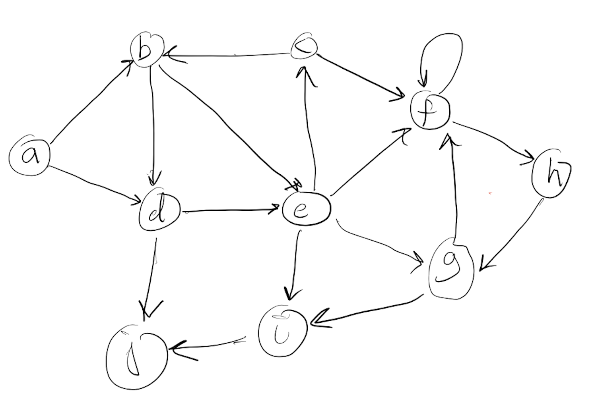

# G07 Graph Theory: Digraphs, DAGs and Quotient Graphs

* [Skill Description](#skill-description)
* [Sample Problems](#Sample-Problems)
* [Skill Tutorial](#Tutorial)
* [Answers to Sample Problems](#Answers)
* [Further Reading](#Reading)

---

# Skill Definition
Ability to calculate the equivalence classes of a relation defined by a digraph D and form the related DAG D'

---

# Sample-Problems

## Problem 1
| Text | Graph |
|-|-|
|For the digraph on the right, determine the equivalence classes of vertices with respect to the path partial order (i.e. $a\preceq b$ if there is a path from a to b) and factor the digraph into a DAG whose nodes are those equivalence classes||

## Problem 2.

---

# Tutorial

## Directed Graphs

A **directed graph (or digraph)** $G$ is a pair $(V,E)$ where $V$ is a set of vertices or nodes, and $E$ is a subset of $V \times V$ called the edges of $G$.
We can draw a 2d visual representation of a graph by plotting each of the points $v$ of $V$ as distinct point $p(v)$ on the x-y plane and then
for each edge $(a,b)$ in $E$ draw a line between the points $p(a)$ and $p(b)$, usually with an arrow at the end point to $b$. 

We say that the the edge $d=(a,b)$ goes from $a$ to $b$,
* $a$ is the tail of $e$
* $b$ is the head of $b$

## Path and Cycles
A **path** in a digraph is a connected sequence of edges starting at a vertex $v$ and ending at a vertex $w$.
If $v=w$ then we say that the path is a **cycle**, that is, it is a path that ends at the same vertex it started at.

## Directed Acyclic Graphs
A graph without any cycles is called a **directed acyclic graph** or **DAG**

## Factoring a digraph
Any directed graph can be factored into a DAG whose elements are equivalence classes of the relation
defined by $a\equiv b$ if there is a path from a to b and vice versa. There is a edge from node A to node B
in the DAG if there is an edge from some node a in A to some node b in B.

---
---

# Answers

## Problem 1
|Text | Graphs |
|-|-|
|For the digraph in Problem 1, the equivalence classes are (a) (bcde) (fgh) (i) (j)||
|Here is the result of factoring the digraph above into a DAG.||

## Problem 2

---
