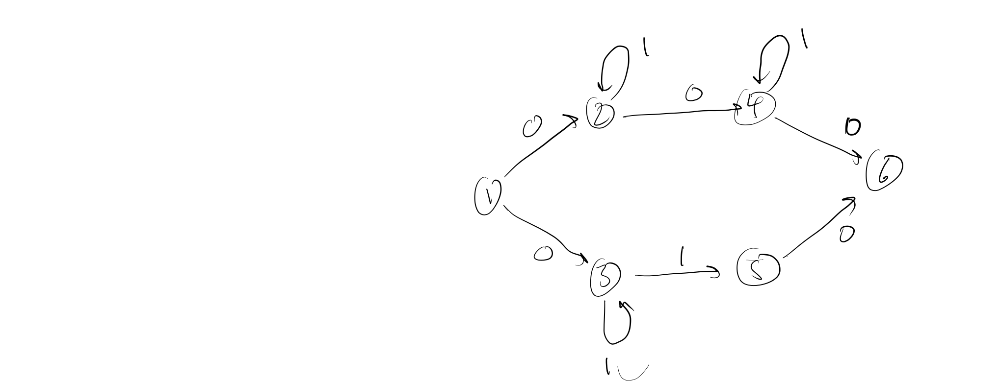
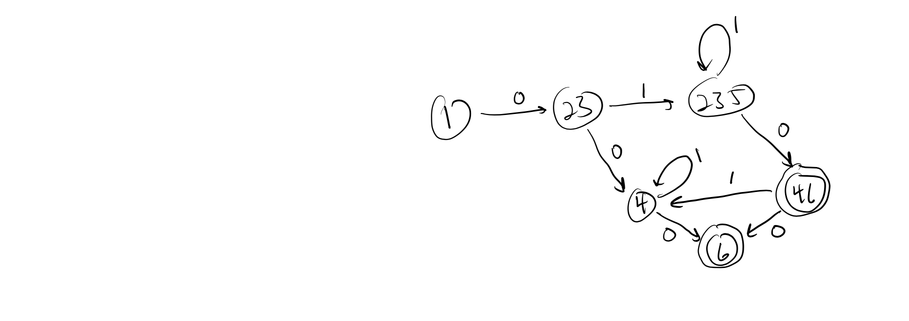

# G08 Graph Theory: DFAs, NFAs, and Regular Languages


* [Skill Description](#skill-description)
* [Sample Problems](#Sample-Problems)
* [Skill Tutorial](#Tutorial)
* [Answers to Sample Problems](#Answers)
* [Further Reading](#Reading)

---


# Skill Definition


---

# Sample-Problems

## Problem 1


## Problem 2.


---

# Tutorial

## Labelled graphs
Sometimes we label the edges of a digraph.

## Finite State Machines aka Deterministic Finite Automata
A good example of a digraph is a finite state machine which is used to define "regular expressions" that can easily
be recognized by computer programs. We'll give some examples in class. The edges of a DFA are labelled with characters from some alphabet. One of the nodes is identified as the start state, and one or more nodes are final states. A string of characters
is accepted by the DFA if it can be generated by a character labels on a path starting at the start state and ending in a final state.

Here is an example of a DFA that will accept binary numbers with an even number of 1's.


For example, here is a path that accepts the string 00101100010

|char | |0| |0| |1 ||0| |1| |1| |0| |0| |0| |1| |0| |
|-    |-|-|-|-|-|-|-|-|-|-|-|-|-|-|-|-|-|-|-|-|-|-|-|
|state|1| |1| |1| |2| |2| |1| |2| |2| |2| |2| |1| |1|

**DFA Skill** - determine a DFA for some set of strings and/or determine if a string is accepted by a particular DFA

## Non-deterministic Finite Automata
We can create a more general finite state machine where allow multiple edges out of a node to have the same label.
We say that a string is accepted by the NFA is there is some path which is labelled by the characters of that string.

### NFA example 1
Here is an example of an NFA accepting some subset of binary numbers:



and here is a trace that shows it accepts the string 0111011
|char | |0| |1| |1| |1| |0| |1| |0| |
|-    |-|-|-|-|-|-|-|-|-|-|-|-|-|-|-|
|state|1| |2| |2| |2| |2 ||4| |4| |6|

It can be tricky trying to see if an NFA accepts a given string because there are so many possible paths to consider,
but it turns out that every NFA can be converted into a DFA where the nodes of the DFA are sets of NFA nodes that
represent all of the possible states one can be in after following any path leading to that node....

Here is the DFA generated from the NFA above



and we can see how it accepts that same string

|char | |0|  |1|   |1|   |1|   |0|  |1| |0| |
|-    |-|-|- |-|-  |-|-  |-|-  |-|- |-|-|-|-|
|state|1| |23| |235| |235| |235| |46| |4| |6|


## Regular Expressions

We won't go into detail about it in this class, but NFAs and DFAs are very useful when writing compilers (programs that
convert high level languages into machine code). They are used for defining and recognizing the lexical tokens of a
programming language (i.e. the "words" of the language). There is another equivalent way of specifying NFAs using
regular expression notation. These expressions combine the characters of the language being recognized with some operators
* E = a character
* E = F G   (meaning its an F followed by a G)
* E = F*  (meaning 0 or more Fs)
* E = F+G (meaning an F or a G)

So the regular expression corresponding to the first DFA accepting binary strings with an even number of 1s is

```
0*(10*10*)*
```

and the NFA is 
```
(01*01*0)+(01*10)
```

---
---

# Answers

## Problem 1

## Problem 2


---
