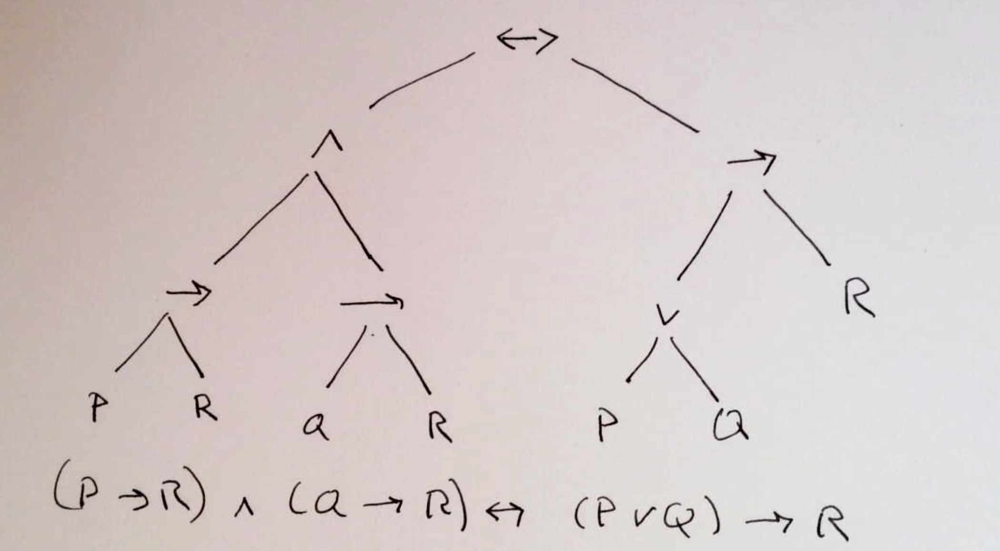

# F01 Propositional Calculus: Syntax and Semantics of Propositional Calculus

* [Skill Description](#skill-description)
* [Sample Problems](#Sample-Problems)
* [Skill Tutorial](#Tutorial)
* [Answers to Sample Problems](#Answers)
* [Further Reading](#Reading)

---

# Skill Description
## Skill specification
Ability to evaluate a propositional formula given a True/False interpretation for the propositions in the formula. This also requires the ability to recognize whether a formula is syntactically correct and to be able to draw a parse tree for an expression and evaluate the truth value at every node. We assume that the grammar uses the standard logical operators: AND, OR, NOT, IMPLIES, IFF, XOR both in English and in traditional Mathematical notation.

---

# Sample Problems
We test your mastery of this skill by asking you to determine if a formula is syntactically correct, and if so to draw its parse tree and use the parse tree to evaluate the formula on a particular interpretation of the propositions.

## Problem 1
Draw the parse tree for the formula
 $(P \rightarrow R) \wedge(Q\rightarrow R)) \leftrightarrow (P\vee Q \rightarrow R)$

## Problem 2
Evaluate the formula in Problem 1 with the interpretation P=F, Q=T, R=F.

---

# Tutorial

The Propositional Calculus is a formal language for expressing logical concepts. 

The primitives are propositions (typically named P, Q, R, ...) which are assumed to be either true or false. 
These are connected to form sentences using the logical connectors: and, or, not, and others. 

## Propositional Sentences
Sentences in the Propositional calculus are formed by primitives called propositions (typically named P, Q, R, ...)
joined together with logical operators (and, or, not, and others) to form sentences, which likewise are either true or false
(depending on the values of the primitive propositions).

The operators are usually written with special symbols (where P and Q are propositional sentences)

| Math | Text | Meaning |
| --- | ----  | --- |
| $\neg P$ |  not(P) |  This is the negation of P and is true precisely when P is false.|
| $P \wedge Q$ |  P AND Q | This is the conjuntion of P and Q and is true both P and Q are true|
| $P \vee Q$ | P OR Q |This is the disjunction of P and Q and is true if P or Q or both are true|
| $P \rightarrow Q$  | P IMPLIES Q    P ONLYIF Q | This is the implication, if P then Q, and it is true when P is false or Q is true.|
| $P \leftarrow Q$  | P IF Q | This is the implication, Q implies P, if Q then P, and it is true when Q is false or P is true.|
| $P \leftrightarrow Q$ | P IFF Q | This is true when P and Q have the same truth value, i.e. P is true IF AND ONLY IF Q is true.|
| $P \oplus Q$ |  P XOR Q | This is true if P or Q but not both are true, it is called the exclusive OR|

This language is also called Boolean Algebra and the sentences are formulas in Boolean algebra. 
Many of the familiar properties of high school algebra also hold true in Boolean Algebra.

Each sentence has a truth value (true or false) which can be obtained from the truth values of the propositions using a truth table.

 
## Definitions of some terms related to Propositional Calculus
An assignment of truth values $\\{T,F\\}$ to a set of variables is called an __interpretation__ e.g.

$P\mapsto F$ 
$Q\mapsto T$ 
$R\mapsto F$ 

A formula which is true for all interpretations is called a __tautology__

The formula  $P \vee \neg P$ is a tautology.

A more complex tautology is $(P \rightarrow R) \wedge(Q\rightarrow R)) \leftrightarrow (P\vee Q \rightarrow R)$.

A formula is __satisfiable__ if there is at least one interpretation which makes it true.

If $\neg E$ is not satisfiable, then E is a tautology.

The formula  $\neg (P \wedge Q)$ is satisfiable, but is not a tautology.

The formula $P \wedge \neg P$ is not satisfiable.

How long does it take to test if a formula with N variables is a tautology using a truth table?

---

# Answers

## Problem 1
Draw the parse tree for the formula
 $(P \rightarrow R) \wedge(Q\rightarrow R)) \leftrightarrow (P\vee Q \rightarrow R)$

**Answer:** 

## Problem 2
Evaluate the formula in Problem 1 with the interpretation P=F, Q=T, R=F.

**Answer:**

---

# Readings
Here are some chapters in free online textbooks covering these concepts
* DM-AOI Ch 0.2 http://discrete.openmathbooks.org/dmoi3/sec_intro-statements.html
* DM-AOI Ch 3.1 http://discrete.openmathbooks.org/dmoi3/sec_propositional.html
* MfCS Ch3-1-3.5 in  https://ocw.mit.edu/courses/electrical-engineering-and-computer-science/6-042j-mathematics-for-computer-science-spring-2015/readings/MIT6_042JS15_textbook.pdf
  

