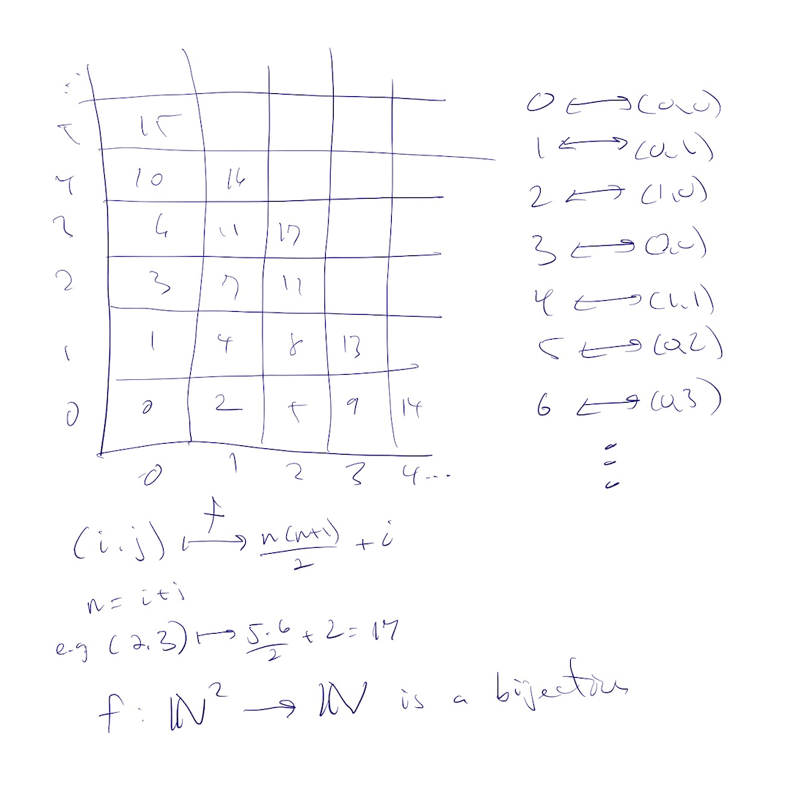

# G10: Sets: Countability

* [Skill Description](#skill-description)
* [Sample Problems](#Sample-Problems)
* [Skill Tutorial](#Tutorial)
* [Answers to Sample Problems](#Answers)
* [Further Reading](#Reading)

---

# Skill Description
The ability to prove that an infinite set is, or is not, countable.

---

# Sample Problems

## Problem 1
Prove that the set of all Python programs is a countable set.

## Problem 2
An algebraic number is a complex number that is a root of a polynomial $p(x)=\sum_{i=0}^n a_i x^i$
where the $a_i$ are integers.  Let $\overline Q$ be the set of algebraic numbers. Prove that it is a
countable set.

## Problem 3
Let $S^+$ be the set of infinite sequences $(s_0,s_1,s_2,\ldots)$ of natural numbers which are non-decreasing
(that is $s_i\le s_{i+1}$ for all i). Prove that $S^+$ is uncountable.  (Hint: look at the difference sequences
$s_{i+1} - s_i$).

---

# Tutorial
# Countable and Uncountable Sets
We say that a set $S$ is countable if there is a surjective function $f$ from $\mathbb{N}$ to $S$.
If no such function exists we say that $S$ is uncountable.

If a set is countable, then the sequence

$(f(0), f(1), f(2), \ldots )$

can be thought of as counting the elements of $S$ and each element $s$ of $S$ will appear as $f(n)$ for some $n$
because $f$ is surjective.  Some elements of $s$ might appear multiple times unless the function is also injective.
You can try to prove that if there is a surjective $f$ then we can always find a bijective function from $\mathbb{N}$ to $S$.

Conversely, if we can create a sequence $(s_0, s_1, s_2, \ldots)$ which contains each element of $S$ at least once, then
$S$ is countable and the function $f(i)=s_i$ is a surjective function from $\mathbb{N}$ onto $S$.

Let's look at some examples:
* the set E of positive even numbers are countable (let $f(x) = 2x+2$) E = 2,4,6,...
* the set O positive odd numbers are countable (let $f(x) = 2x+1$) O = 1,3,5,...
* the set P positive prime numbers are countable (let $f(n)$ be the nth prime number) P=2,3,5,7,11,13,...

What about other sets like the integers, pairs of integers, the rationals, the reals, the powerset of the integers, functions from integers to integers, etc.
We'll answer those questions next, and the first two are countable, the last three are not!

**Proposition.** If S and T are countable sets, then so is $S\cup T$.

**Proof:** let $f$ and $g$ be the counting functions for S and T respectively.
Define h as follows:
* h(2n) = f(n)
* h(2n+1) = g(n)

Then h is surjective onto $S\cup T$.

We can also prove it by creating a sequence containing all elements of $S\cup T$.
If $s_0, s_1, s_2, \ldots$ and $t_0, t_1, t_2,\ldots$ are sequences containing all element of $S$ and $T$, respectively,
then we can interleave them to get a sequence with all elements of $S\cup T$:

$s_0,t_0,s_1,t_1,s_2,t_2,\ldots$

**QED**

**Corollary.** The integers $\mathbb{Z}$ are countable.

**Proof:** It is easy to show that the negative integers, $\mathbb{Z}^-$ are countable,
and $\mathbb{Z} = \mathbb{N} \cup \mathbb{Z}^-$ is the union of two countable sets
and so is countable. **QED.**

**Proposition.** If S is a countable set, then so is any non-empty subset $T$.

**Proof:** let $f$  be the counting functions for S and let $a$ be any element in T.
Define h as follows:
* h(n) = f(n) if f(n) is in S
* h(n) = a otherwise

Then h is surjective onto $T$.
**QED**

**Proposition:** $\mathbb{N}^2$ is a countable set.

**Proof:** To prove this we will define a bijection from $\mathbb{N}^2$ to $\mathbb{N}$
We can visualize $\mathbb{N}^2$ as a rectangular grid 
and we can number the pairs (i,j) starting at (0,0) and the numbering each diagonal from top to bottom
as shown in the following image:

This shows that the function $f:\mathbb{N}^2\rightarrow\mathbb{N}$ defined by
* $f((i,j) = n(n+1)/2+i$  where $n=i+j)$

is a bijection.  Since it is a bijection, there is an inverse map $G$ which maps $\mathbb{N}$ onto $\mathbb{N}^2$
where 
* $G(0)=(0,0)$
* $G(1)=(1,0)$
* $G(2)=(0,1)$
* $G(3)=(2,0)$
* $G(4)=(1,1)$
* $\ldots$

and this shows that $\mathbb{N}^2$ is countable.

We could also show that it is a union of finite sets $S_n$ where $S_n$ is the set of all pairs $(a,b)$
where $a+b=n$. Each $S_n$ is finite and every pair $(a,b)$ is in $S_n$ for some $n$ ($n=a+b$).
**QED**
  
**Proposition:** If $S_0,S_1,\ldots$ is a countable sequence of countable sets, then their union

$S = \bigcup_\limits{i=0}^\infty S_{i}$

is a countable set.

**Proof**
We know we have a bijective map $G:\mathbb{N}\twoheadrightarrow\mathbb{N}^2$,
and if we let $f_i:\mathbb{N}\twoheadrightarrow S_i$ be a surjective map counting the 
elements of $S_i$, then we can define
* $h(i,j) = f_i(j)$
so $h:\mathbb{N}^2 \twoheadrightarrow S$

and so $h\circ G$ maps $\mathbb{N}$  to $\mathbb{N}^2$ to $S$ is surjective, so $S$ is countable.
**QED**

But what about the rational numbers?

**Theorem**. The rational numbers $\mathbb{Q}$ form a countable set.

**Proof.**
Define $h(i,j) = i/j$ if $j\ne 0$ and $h(i,j) = 0$ if $j=0$, then $h$ is a surjective map
from $\mathbb{N}^2$ onto the rationals $\mathbb{Q}$.
So if we let $G:\mathbb{N}\rightarrow \mathbb{N}^2$ be the surjectifve map defined above,
then $h\circ G$ is a surjective map from $\mathbb{N}$ onto $\mathbb{Q}$.
**QED**

---

## Best Approach to proving a set is countable

Here is a really good "tool" to use to prove that a set is countable.

**Theorem** Let $S_0, S_1,\ldots$ be an infinite sequence of finite sets, then 
$S=\bigcup_\limits{i=0}^\infty S_i$ is countable.

**Proof:** We just have to show how to construct a list that contains every element of $S$.
This is easy!  First list all of the elements in $S_0$, then all the elements in $S_1$, etc.
Since $S$ is the union of the $S_i$, any $s\in S$ will be in one of the $S_i$ and hence will be in
this list. **QED**

---

**Corollary** The set of rational numbers $\mathbb{Q}$ is a countable set.

**Proof:**
We can use the previous theorem to show the rationals are countable by letting $S_i$ be the set of all rational numbers 
$r/s$ where $-i \le r,s \le i$.  

Each of these sets $S_i$ is finite (why?) and every rational
number $r/s$ is in at least one $S_i$ (why?). 

So $\mathbb{Q}$ is a countable union of finite sets and hence is countable.
**QED**

# Uncountable Sets and the Diagonalization Proof

So we have seen that several big infinite sets are countable, but not all sets are countable.
We'll now look at two uncountable sets. First lets show that there are no surjections from a set to its powerset.

**Theorem**. For any non-empty set $S$, there does not exists a surjection from $S$ to its power set.

**Proof.**
We will prove this by contradiction. Suppose it is false.
Then there is a surjective function $f$ which takes elements $a\in A$ to subsets $S_a$ of $A$.
That is

$f(a) = S_a$

where $a\in A$ and $S_a\subseteq A$.

Let us define T to be the set of all elements $a$ such that $S_a$ does not contain $a$:

$T = \\{a \in A | \  a \not\in S_a\\}$

Since $f$ is surjective, there must be some element $b\in A$ with $T = S_b$.

There are two cases and we will show both lead to a contradiction, hence showing that
$f$ can not be surjective.

case 1: $b \in T$.  In this case, by the definition of $T$ we know $b\not\in S_b$. But $S_b$ was chosen to be equal to $T$.
So $b \not \in T$, which is a contradiction.

case 2: $b\not\in T$. In this case, since $T=S_b$ we known that $b \not\in S_b$, so by the definition of $T$, $b\in T$,
and this is also a contradiction.

Both cases lead to a contradiction, so there can be no such surjective function $f$. **QED**

---

**Corollary.** The power set of $\mathbb{N}$ is not countable!

**Proof:** By the Theorem there is no surjection from $\mathbb{N}$ to its powerset ${\cal P}(\mathbb{N})$
so ${\cal P}(\mathbb{N})$ is not countable, by definition. **QED**

**Theorem** The set of infinite decimal numbers is not a countable set.

**Proof:** We will prove this by contradiction.   Suppose it is not true. Then there is a surjection
$f:\mathbb{N}\twoheadrightarrow I$ which maps each natural number $n$ to an infinite decimal number 
* $f(n) = 0.b_{n1} b_{n2} b_{n3}\ldots$

We can now construct a new infinite decimal number $t$ defined
by 
$t=0.t_1 t_2 t_3\ldots$

where 

$$t_i = \begin{cases}
b_{ii} + 4 & {\text if} b_{ii}\le 5\\
b_{ii} - 5 & {\text if} b_{ii} > 5\\
\end{cases}
$$

so $t$ differs from $f(i)$ in the $i$ th place, but if $f$ was surjective
then $t=f(m)$ for some $m$ and this is a contradiction as $t$ has a different bit from $f(m)$ at the $m$ th place. 
**QED**

**Theorem.** The set of infinite bit strings is uncoutable.

**Proof:** The same arguments as above works but we let $t_i = 1-b_{ii}$, that is we swap 0s and 1s.
Below is an image which shows how to construct $t$.  This is called a **diagonalization** proof because
we use the diagonal of the purported table of numbers to construct a number which isn't in the list!
**Q.E.D.**

**Corollary.** The set of real numbers is not countable.

**Proof** The proof of this is a little subtle because the real numbers do not precisely correspond to the infinite decimals, even when we restrict to numbers in the range [0,1]. We give a proof sketch here.

Indeed $0.999\overline{999}=1.000\overline{000}$ in base 10, and

and $0.111\overline{111}=1.000\overline{000}$ in base 2

and in general all numbers of the form $n/2^k$ have two such representations as infinite decimals in base 2.
(Maybe we should call them bitimals instead of decimals??)
But these exceptions are a countable set (why?), and if we remove a countable set from an uncountable set,
the result is still uncountable (why?), so the real numbers are an uncountable set. **QED**

## Unknowable numbers....

One interesting observation here is that almost all real numbers are "unknowable" 
in the sense that they can not be precisely described in English (or any other language).  
To see this, just observe that the set of all novels, in any language, 
can be viewed as set of integers in the UNICODE encoding and hence it is a  countable set,  
but the set of real numbers is uncountable, so there are at most a countable number of real numbers 
that could be precisely described (pi and e and sqrt(2) are numbers that can be described precisely!)    

---

# Answers

## Problem 1
Prove that the set of all Python programs is a countable set.

**Answer:**
Each character in a python program comes from a finite set of characters of size $N$ 
(usually the unicode characters where $N=2^{16}$). So we can think of a python program
as a base N number! and hence the python programs are a subset of the natural numbers
and hence are countable, as the natural numbers are countable. 

## Problem 2
An algebraic number is a complex number that is a root of a polynomial $p(x)=\sum_{i=0}^n a_i x^i$
where the $a_i$ are integers.  Let $A$ be the set of algebraic numbers. Prove that $A$ is a
countable set. You can assume that a polynomial of degree $n$ has at most $n$ solutions (it has exactly
$n$ if you count multiple roots correctly).

**Answer:** First we define $A_n$ for any $n$ to be the set of solutions to polynomials of degree less than $n$
whose coefficients $a_i$ are all in the range $[-n,n]$. Each $A_n$ is a finite set. Indeed there are at most
$n^{2n+1}$ such polynomials (there are at most $n$ coefficients as the degree is less than $n$ and each coefficient can take
at most $2n+1$ values). Morover each such polynomial has at most $n$ solutions, so the total size of $A_n$ is less than
$n^{2n+1} * n$ and so it is a finite set.  Moreover, every polynomial is in $A_n$ for some $n$.  Just pick $n$ bigger than the degree and the absolute value of the largest coefficient.  Since $A$ is the union of the $A_n$, it is a countable union of finite sets and hence is countable.

## Problem 3
Let $S^+$ be the set of infinite sequences $(s_0,s_1,s_2,\ldots)$ of natural numbers which are non-decreasing
(that is $s_i\le s_{i+1}$ for all i). Prove that $S^+$ is uncountable.  (Hint: look at the difference sequences
$s_{i+1} - s_i$). You can assume that the set of all infinite sequences of natural numbers is uncountable.

**Answer:** Given a non-decreasing sequence $s$ we can define the sequence $t$ by $t_i = s_{i+1} - s_i$. Then $t_i\ge 0$ for all $i$, so $t$ is a sequence of natural numbers.  Likewise, given a sequence $t$ of natural numbers we can define a non-decreasing sequence $s$ by $s_0=t_0$ and $s_{i+1} = s_i+t_i$ for $i>0$. Then $s_i$ is a non-decreasing function.
Starting with $s$ going to $t$ and back gives us the same $s$ so we see this defines a bijection, so $S^+$ is
the same size as the set of infinite sequences of natural numbers, which we have seen is uncountable.

